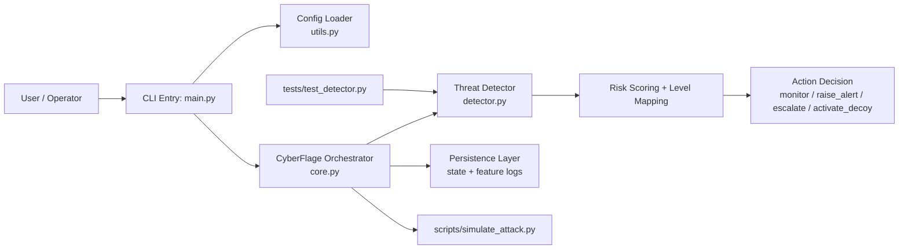
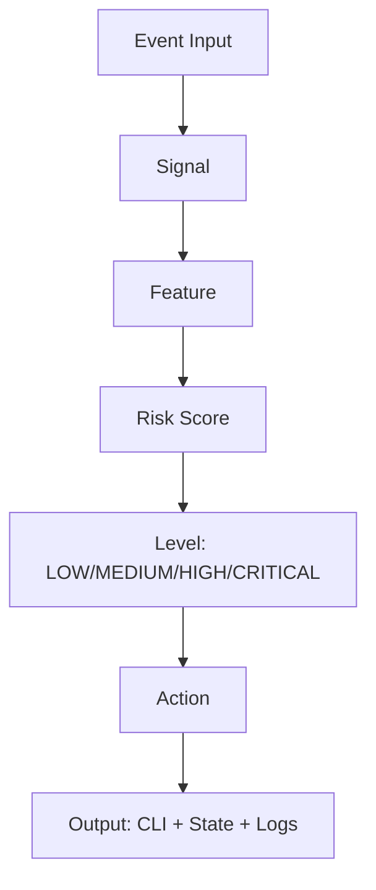
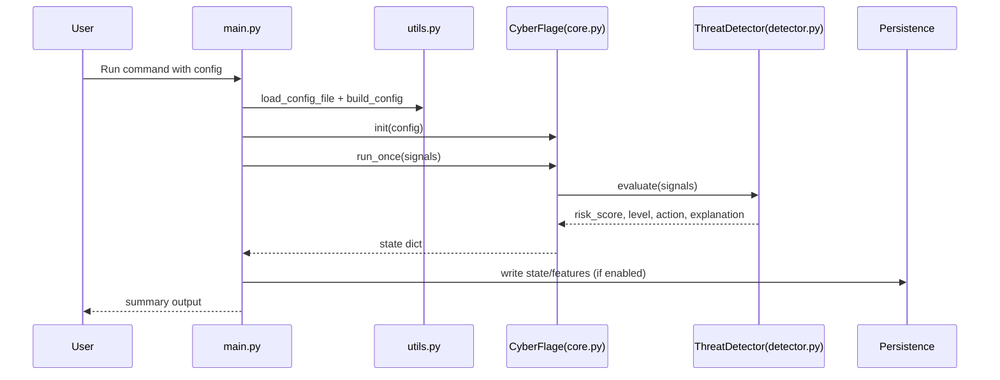

# CyberFlage System Architecture

This document describes the current architecture of CyberFlage Security.

## High-Level Component Diagram

## Runtime Data Flow

## Sequence (Single Run)

## Responsibilities by File

- `main.py`: command-line entry and user-facing run flow
- `cyberflage/core.py`: orchestration (`add_signal`, `run_once`)
- `cyberflage/detector.py`: scoring logic and level/action mapping
- `cyberflage/utils.py`: config defaults, merge, validation/load helpers
- `scripts/simulate_attack.py`: scenario-driven simulation runs
- `tests/test_detector.py`: detector behavior checks

## Notes for GSoC Collaborators

- Core extension points: `detector.py` (scoring/model), `core.py` (action routing), `utils.py` (config schema)
- Best ML insertion point: between `Signal -> Feature -> Risk Score`
- Keep the pipeline explainable by preserving `explanation` outputs
